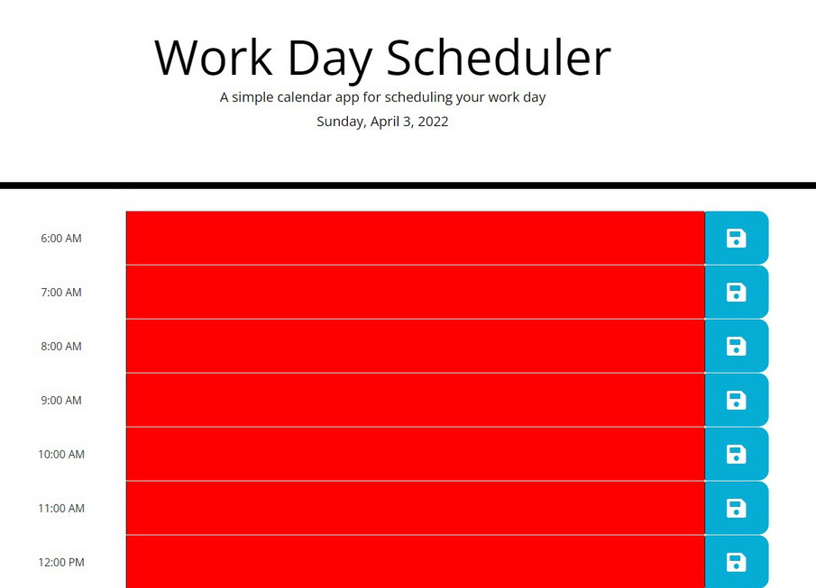

# My Daily Planner
Daily planner Project

## Objective
Develop a daily planner to add tasks too and save entries

## Features
- A daily planner that displays todays date under the page title
- A text area to type entries for various tasks.
- Color coding 
-- Red: hours that have already elapsed
-- Yellow: Current hour
-- Green: hours that have not passed yet.
- Save button to save entries to local storage. (Not done.)

Link to demo site:
https://crimsondrac1.github.io/MyDailyPlanner/

Link to Repo:
https://github.com/Crimsondrac1/MyDailyPlanner.git

